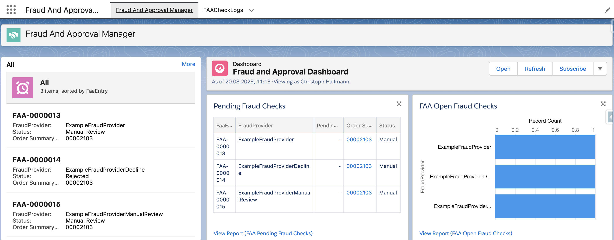
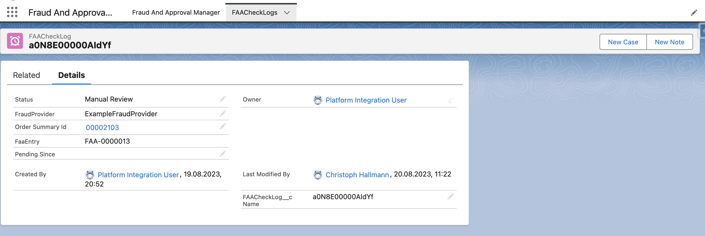
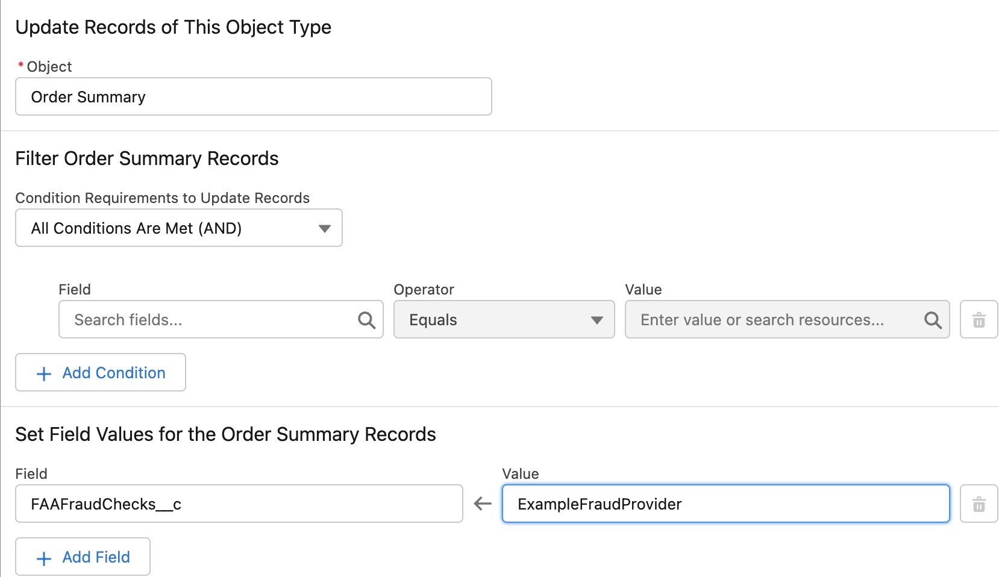

# Fraud and Approval Manager

📣 📣 🦺	🦺	🦺	

Run Fraud Processes on top of your Order Management application, to get an Order approved as smooth as possible.

The Fraud and Approval Manager allows you to run Fraud and Approval checks for different providers on top of your Salesforce Order Management application. 
It orchestrates providers and performs checks to get the Order Summary finally approved.
Every Fraud Status can be reviewed and monitored across the application, getting insights about your order lifecycle.

## Features

This application allows you to run Fraud Checks as an extra step in your order lifecycle.
Fraud Checks can be defined by Order Summary and will be traced in a separate entry.
It allows to gain visibility into your Fraud and Approval flows at any point in time, by having the right information at hand



Gain insights about the current status and more



## Documentation

This section refers to Salesforce Developers and Administrators and provides the information about setting up the application.
This application does not modify your OrderSummary in any way. 
It provides clear entry and stop stages, allowing to start different checks and listen to the final result, once the processes were completed.

#### Platform Events

`FAAProcessStart__e`    : Issue the event, to start the Fraud And Approval Flow for your Order Summary.
`FAAProcessResult__e`   : This is an internal event, it is not recommended to subscribe to it.
`FAAProcessStop__e`     : Subscribe to the event, to get information about the overall endresults of your Fraud checks


#### Setup Permissions and Fields

The FAA App comes with an Own permission Set `FAAOrgAdmin`. This must be assigned to the users, handling Fraud And Approval.
Frauds checks are defined through a multipicklist value, based on  `OrderSummary.FAAFraudChecks__c` 
Ensure that also the `FAAFraudChecks__c` permissions is set in your other permission sets as well.

Afterwards modify the Picklist value to match your Fraud Checks.

*Note* : 
The `FAAFraudChecks__c` ***must*** have the same value as your Fraud Provider. See section [Register a Fraud Provider](####Register-a-Fraud-Provider)


#### Set the Fraud Check

In your order lifecycle, update the `OrderSummary.FAAFraudChecks__c`.


You can define the place where to set this values, mostly this makes sense after `OrderSummaryCreated`. 
Once the values are set, issue a Platform Event `FAAProcessStart__e` to start the proess


#### Register a Fraud Provider

*Naming Convention*

As outline  in [Setup Permissions and Fields](####Setup-Permissions-and-Fields) there is a direct link between `FAAFraudChecks__c` and the FraudProvider.
Lets say you have a Fraud check named `ThirdPartyCreditLimitCheck`, this must be the multipicklist value in `FAAFraudChecks__c`  and also the name of the `ApexClass`


*Apex coding* 

All Fraud implementations must be written as an Apex class.
To register a class, it must extend the `FAACallable` Base Class.
Once a Fraud check is performed, `processComplete` must be invoked, ensuring to get the Order Summary approved
The following illustrates an example

```
public with sharing class ThirdPartyCreditLimitCheck extends FAACallable {
     // Dispatch actual methods
     public override Object call(String orderSummaryId) {
        this.processComplete(<orderSummaryId>, <status>, <provider>);
     }
}
```

Once `processComplete` is invoked, all Fraud checks related to that Order Summary are inspected. If no Fraud Check is pending, a `FAAProcessStop__e` event is issued, providing information about the final fraud check. 
Please listen to this event for further actions.

This application *does not* modify the Order Summary at any point, to be compatible and agnostic of your custom implementations


### Status

Only status which are available in `FAACheckLog__c.Status__c` are supported.
This Frameworks following the general rule:

1. If a single Fraud Check on an OrderSummary is still pending,  `FAAProcessStop__e` with `FraudStatus = Pending` is issued 
2. If no Fraud Checks are pending and  a single Fraud Check on an OrderSummary is rejected, `FAAProcessStop__e` with `FraudStatus = Rejected` is issued 
3. If a single Fraud Check on an OrderSummary is in Manual Review and none is rejected, `FAAProcessStop__e` with `FraudStatus = Manual Review` is issued.
4.  If a single Fraud Check on an OrderSummary is in Manual Review and none is rejected, `FAAProcessStop__e` with `FraudStatus = Manual Review` is issued.
5.  Otherwise  `FAAProcessStop__e` with `FraudStatus = Approved` is issued


### Retrigger Fraud Checks